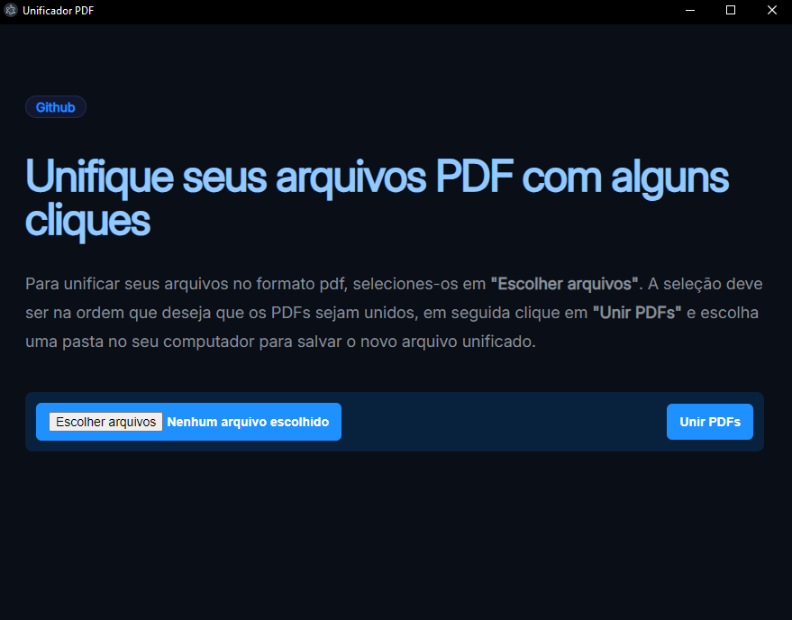

# Aplicativo de Unificação de PDFs com Electron




Este projeto de código aberto é uma aplicação desktop simples construída com Electron que permite aos usuários mesclar vários arquivos PDF em um único documento. A aplicação utiliza a biblioteca PDF-lib para manipulação de PDFs.

## Funcionalidades

- **Selecionar Arquivos PDF**: Escolha múltiplos arquivos PDF do seu computador.
- **Mesclar PDFs**: Combine os PDFs selecionados em um único documento.
- **Salvar PDF Mesclado**: Salve o PDF mesclado no local desejado.

## Pré-requisitos

- [Node.js](https://nodejs.org/)
- [npm](https://www.npmjs.com/)

## Tecnologias Utilizadas

- [Electron](https://www.electronjs.org/pt/): Framework para construir aplicativos desktop multiplataforma com JavaScript, HTML e CSS.
- [PDF-lib](https://pdf-lib.js.org/): Biblioteca JavaScript para criar e modificar documentos PDF.

## Como Funciona

1. **Configuração do Electron:** O framework Electron é inicializado e uma janela é criada para exibir o arquivo index.html.
2. **Interface do Usuário:** Os usuários podem selecionar vários arquivos PDF por meio de um input de arquivo.
3. **Mesclagem de PDFs:** Quando o botão de mesclagem é clicado, os PDFs selecionados são enviados para o processo principal do Electron.
4. **Salvar o Resultado:** O PDF mesclado é salvo no local escolhido pelo usuário.

## Deploy

Abaixo está o link do instalador do aplicativo na versão _1.0.0_, mas caso faça alterações e queira gerar uma nova build, siga os passos mais a diante.

[Baixar Instalador](installer/Unificador%20PDF%20Setup%201.0.0.exe)

### Build

Para realizar o build desse projeto foi utilizada a biblioteca `electron-builder`, a configuração deve ser feita no arquivo `package.json` na seção `build`.

```json
"build": {
    "appId": "com.seunome.pdfhelperjs",
    "productName": "Unificador PDF",
    "files": [
      "main.js",
      "src/js/renderer.js",
      "src/index.html",
      "src/assets/styles/main.css",
      "package.json"
    ],
    "win": {
      "target": "nsis",
      "icon": "src/assets/icons/icon.ico"
    },
    "mac": {
      "target": "dmg",
      "icon": "src/assets/icons/icon.icns"
    },
    "linux": {
      "target": "AppImage",
      "icon": "src/assets/icons/icon.png"
    },
    "nsis": {
      "oneClick": false,
      "perMachine": true,
      "allowToChangeInstallationDirectory": true,
      "createDesktopShortcut": true,
      "createStartMenuShortcut": true,
      "shortcutName": "Unificador PDF"
    }
  },
```

É importante ficar atento aos nomes como `productName`, que será o nome exibido no executável, e `name`, que será usado no pacote de instalação.

Adicione também o script para o **build**:

```json
"scripts": {
    "build": "electron-builder"
  },
```

Finalmente, para gerar o build da aplicação execute:

```shell
npm run build
```

Será gerado um instalador e também o programa pronto para uso na raiz do projeto.
